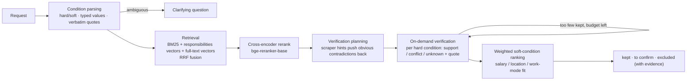

# Job Intelligence Agent

[English](README.en.md) | [简体中文](README.md)

       [](LICENSE)

A job-search agent: a natural-language request goes in, a list of jobs **with source-text evidence** comes out. The central question is whether a job satisfies the user's hard conditions, and the answer should come from evidence in the posting itself, not from a similarity score and not from a blunt hard filter. The system parses the request into typed hard/soft conditions, narrows candidates with retrieval and reranking, and only then asks an LLM to check each hard condition against the posting and quote it. Only a *verified conflict* excludes a job; a job with insufficient evidence is marked "to confirm" and is never treated as satisfied. The corpus is 2,613 frozen job snapshots (HackerNews "Who is Hiring" plus the public Greenhouse/Lever APIs).

## Background

The project started as a course project for **Information Retrieval and Web Agents** (EN.601.466/666, taught by Prof. David Yarowsky, Johns Hopkins University, Spring 2026): crawler, MySQL storage, TF-IDF/BM25 retrieval, a multi-field scoring engine and a centroid classifier. After the course I added two layers: the vNext pipeline (Planner, Dense + RRF, LLM reranking, rule-based Verifier, cross-turn memory) and the **evidence-verifying agent** this README is mostly about (`src/agent/`). The older pipeline is still in the repository (`src/pipeline/` etc.; `streamlit run app.py` is its demo) and serves as a baseline; `docs/system_design.md` describes it.

This standalone repository was split out of the course repository on 2026-09-16 with a squashed history, so commit dates do not reflect the original timeline.

## How it works



1. **Condition parsing** (`conditions.py`): the request becomes a set of conditions, each with a field (role focus, skill, salary, region, work mode, employment type, seniority, other), hard/soft strength, a typed value, and a quote that **must be a verbatim span of the request**; a quote that does not match is rejected and retried with feedback. A cross-field "or" ("Austin or fully remote") is not split into two independent hard conditions; it raises a clarifying question. A request with no extractable condition ("A good job") also gets a clarifying question instead of an error.
2. **Retrieval** (`retrieval.py`): three channels — BM25, semantic search over the *responsibilities* segments only (so a posting that merely lists a skill under "requirements" does not look like one that does the work), and semantic search over the start of the full text — fused by RRF on ranks. Each candidate keeps its rank at every stage so a ranking change can be explained. Without embeddings the search degrades to BM25 and the trace says so.
3. **Rerank** (`rerank.py`): the `bge-reranker-base` cross-encoder. Job text is segmented beforehand into responsibilities / requirements / company background (`segmentation.py`) with character offsets kept, so any later evidence quote can be located in the source.
4. **On-demand verification** (`verification.py`, `evidence.py`): the verifier walks the ranked list and asks the LLM for a "support / conflict / unknown" verdict on each hard condition of each job, with a quote that must be found in the posting; a support/conflict whose quote cannot be found is downgraded to "unknown" and not cached. Only a verified conflict excludes a job (shown with its evidence); an unknown hard condition puts the job in "to confirm", ranked below confirmed jobs. Verification is bounded (LLM calls, candidates, deadline, retries) and judgments are cached by (content hash, condition, model, prompt version).
5. **Verification planning** (`planning.py`): before any call, the scraper's salary/location/work-mode hints are graded against the hard conditions and clearly contradicted candidates are moved back to save calls. This step **never excludes a job**.
6. **Ranking and revision** (`scoring.py`, `fit.py`, `explain.py`): jobs that pass are ranked by soft conditions and weights; salary, location and work-mode fit reuse the legacy engine's asymmetric salary decay and metro-area proximity. The user can change strengths, change weights or drop conditions; the system reuses existing judgments, re-ranks, and explains why ranks moved.
7. **Service and orchestration**: a FastAPI service (`api.py`; states `complete` / `partial` / `clarify` / `failed`; versioned conditions; identical concurrent requests share one computation), a LangGraph graph over retrieve → rerank → plan → verify with bounded retry (`graph.py`), and a Streamlit page that compares the stages side by side (`pages/agent_compare.py`).

## Evaluation

The evaluation harness is in `src/agent/evaluation.py`: snapshots, conditions and LLM calls are frozen and can be replayed offline; total spend is capped and further requests are refused once the cap is reached. **Every number below comes from files under `data/eval_results_agent_run2/`; none are hand-written.**

### Requirement understanding (human-reviewed gold)

| Set | Strict condition P / R / F1 | Whole request exactly right | Clarification raised when expected | Asked when not expected |
|---|---|---|---|---|
| dev (30 requests; the prompt was tuned on it) | 0.805 / 0.835 / 0.820 | 11 / 30 | 2 / 5 | 0 / 25 |
| held-out (24 requests; run once, prompt not changed afterwards) | 0.767 / 0.805 / 0.786 | 6 / 24 | 2 / 5 | 1 / 19 |

Parser prompt v1 → v2 on dev: F1 0.723 → 0.820, whole-request exact 3 → 11. On held-out, 2 requests still produced a hard condition they should not have (a cross-field "or" was split). Seven held-out requests go beyond the current schema (region exclusions, salary range upper bound, "mid or senior", ...); those conditions are marked unscored.

### Ranking and verification (16 queries, 8 dev + 8 holdout, k = 5, per-query means)

Relevance labels are **model-made silver labels** (annotator prompt differs from the system's). "valid" = relevant to the role and every hard condition confirmed satisfied; "wrong accept" = shown, but the silver labels call it irrelevant or a hard condition violated (unconfirmed pass-throughs count).

| System | dev valid@5 | dev wrong@5 | dev nDCG@5 | holdout valid@5 | holdout wrong@5 | holdout nDCG@5 | LLM calls/query |
|---|---|---|---|---|---|---|---|
| Retrieval (raw request) | 1.12 | 3.38 | 0.376 | 1.38 | 3.38 | 0.431 | 0 |
| Retrieval (role/skill text) | 0.62 | 3.88 | 0.224 | 1.25 | 3.75 | 0.292 | 0 |
| + cross-encoder rerank | 0.75 | 3.62 | 0.220 | 1.50 | 3.38 | 0.504 | 0 |
| + verify top-k only | 0.50 | 0.25 | 0.243 | 1.38 | 0.50 | 0.503 | 4.6 / 5.0 |
| + on-demand verification (backfill) | 1.00 | 0.75 | 0.443 | 1.62 | 1.88 | 0.537 | 15.1 / 14.8 |
| + verify everything | 1.00 | 0.75 | 0.443 | 1.62 | 1.88 | 0.537 | 17.9 / 19.4 |

How to read it:

- **Verification cuts wrong accepts**: against rerank alone, wrong@5 goes 3.62 → 0.75 on dev and 3.38 → 1.88 on holdout.
- **On-demand vs verify-top-k-only**: +0.50 valid@5 on dev (95% interval [+0.12, +0.88]), +0.25 on holdout (interval [0, +0.75], not significant); it costs about 10 more calls because top-k-only drops excluded jobs without backfilling.
- **On-demand vs verify-everything**: identical valid@5 on all 16 queries, about 20% fewer LLM calls.
- **Rerank and role/skill-text retrieval have no stable gain**: the rerank improvement over retrieval order (+0.12 dev, +0.25 holdout) has an interval containing 0 on both, and role/skill-text retrieval is no better than the raw request.
- **Verification planning** does not change valid@5; it saves only 0.1–0.4 calls per query.
- Judge prompt v2 vs v1: wrong excludes 11 → 6, higher valid and nDCG, but more unconfirmed pass-throughs (5 → 17). Unconfirmed pass-throughs carry the "to confirm" flag.

### Reuse after revising conditions (5 new requests × 4 revisions = 20, real pipeline)

| Revision | LLM calls, reuse | LLM calls, full recompute | Time, reuse | Time, full recompute | Same kept set |
|---|---|---|---|---|---|
| change weight | 3.0 | 18.8 | 3.98s | 15.96s | 4 / 5 |
| tighten soft → hard | 3.2 | 18.8 | 4.55s | 15.16s | 4 / 5 |
| relax hard → soft | 1.8 | 10.0 | 3.42s | 9.42s | 5 / 5 |
| remove a condition | 4.2 | 11.2 | 6.67s | 11.55s | 3 / 5 |

Reuse clearly cuts calls, but the kept set does not always match a full recompute (16 of 20 do); the mismatching rows are kept in the result file, not filtered out.

### Limitations

- Silver labels are model-made and there is no human end-to-end gold; there are only 16 queries, and 30 + 24 requests for requirement understanding, whose gold I drafted and a human then reviewed.
- The ranking/verification fixes were made after inspecting those 16 queries, so neither dev nor holdout there is a clean final evaluation; treat them as development metrics and a regression set.
- Verification runs on frozen snapshots only; it does not fetch further detail from external sources.
- The reuse experiment covers only 5 requests.

## Design points

- **A hard condition excludes a job only with source-text evidence of a conflict**, and excluded jobs are shown with that evidence so the user can see and overrule it.
- **Evidence is checkable**: a quote must be locatable in the posting's normalized text, otherwise the verdict is downgraded to "unknown".
- **Unknown is not treated as satisfied**: insufficient evidence means "to confirm", ranked below confirmed jobs.
- **Reproducible evaluation**: frozen snapshots, conditions and LLM log; numbers are produced by scripts, not typed in.
- The legacy engine's salary decay and metro proximity are reused rather than rewritten (`src/agent/fit.py`).

## Demo

```bash
conda activate jobir
streamlit run app.py        # the agent_compare page in the sidebar is the stage-by-stage view of the new agent
```

## Quick start

1. **Conda environment**: `conda activate jobir` (Python 3.11; dependencies in `requirements.txt`). The first use of the reranker downloads `BAAI/bge-reranker-base` (about 1.1 GB).
2. **Environment variables**: `cp .env.example .env` and set `OPENAI_API_KEY`.
3. **Job snapshots**: `data/agent/snapshots.db` is not tracked; the first evaluation run imports `data/structured_jobs.json` into it if it is empty.

```bash
# offline replay evaluation (no requests, no cost)
python -m scripts.run_agent_eval run --mode replay

# requirement-understanding evaluation (calls the LLM, about $0.01)
python -m scripts.eval_requirements parse --gold data/agent_eval/requirements_heldout.json --out data/eval_results_agent_run2/requirements_heldout
python -m scripts.eval_requirements score --gold data/agent_eval/requirements_heldout.json --out data/eval_results_agent_run2/requirements_heldout

# start the API
uvicorn src.agent.api:create_default_app --factory

# unit tests (offline)
pytest tests/
```

API: `POST /search`, `GET /tasks/{id}`, `POST /tasks/{id}/run`, `POST /tasks/{id}/revise`, `GET /jobs/{key}`, `GET /health`.

Setup and usage of the older pipeline (MySQL + TF-IDF/BM25/Dense + LLM rerank + rule-based Verifier) are described in `docs/环境配置.md`; its CLI entry is `python -m src.pipeline.graph "<query>"`.

## Project layout

```
├── src/
│   ├── agent/            # evidence-verifying agent: conditions, segmentation, retrieval, rerank, verification, planning, ranking, evaluation, API
│   ├── spider/           # crawler + information extraction
│   ├── db/               # older pipeline: MySQL storage and cross-turn preference memory
│   ├── ir/               # TF-IDF / BM25 / Dense retrieval + RRF + query expansion
│   ├── scoring/          # older multi-field scoring engine, LLM reranker, rule-based Verifier
│   ├── classification/   # vector centroid classifier
│   ├── llm/              # older pipeline: query understanding and answer generation
│   ├── pipeline/         # older pipeline: LangGraph orchestration
│   └── observability.py  # per-call latency / token / cost trace
├── scripts/              # evaluation and diagnosis scripts (run_agent_eval, eval_requirements, eval_incremental, ...)
├── pages/                # Streamlit pages (agent_compare)
├── data/
│   ├── agent_eval/                 # query sets and requirement annotations (dev / held-out)
│   ├── eval_results_agent_run2/    # agent evaluation artifacts (run2–run5, requirement understanding, revision reuse, frozen LLM log)
│   ├── eval_results/               # historical baseline used for the course report
│   └── eval_results_vnext/         # evaluation data of the older vNext pipeline
├── docs/                 # older pipeline design doc, environment setup
├── tests/                # unit tests (offline)
└── .github/workflows/    # CI
```

## License

[MIT](LICENSE)
