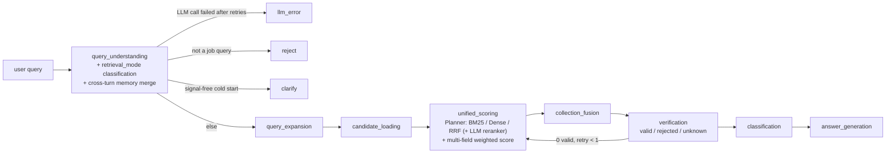
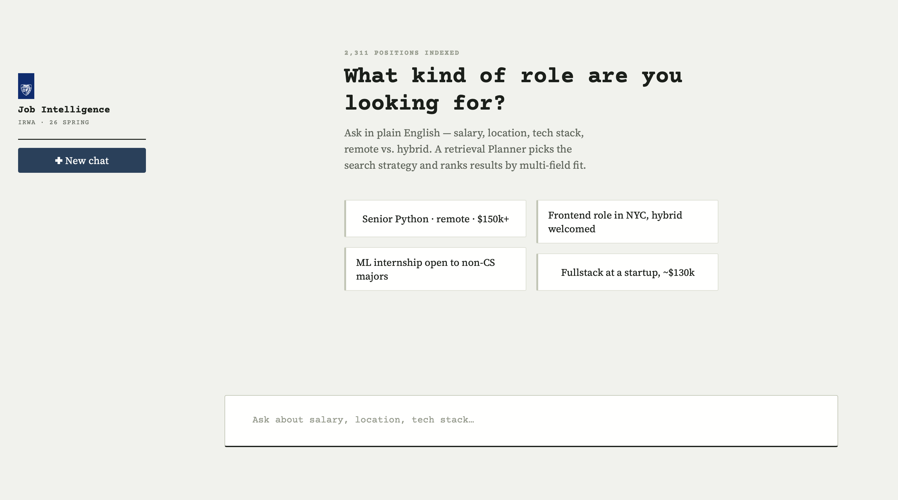

# Job Intelligence Agent

[English](README.md) | [简体中文](README.zh-CN.md)

      [](LICENSE)

Natural-language job search over 2,311 postings from HackerNews "Who is Hiring" and the public Greenhouse/Lever APIs. Most systems in this space pick one of two extremes: hard-filter on salary/location and throw away close matches, or hand everything to an LLM and lose control over ranking. This project takes a third path — a from-scratch multi-field scoring engine with continuous, decay-based fields, a retrieval Planner that adapts strategy per query, and an LLM used narrowly (query understanding, reranking, answer generation) rather than as the sole judge of relevance.

## Background

This project started as coursework for **Information Retrieval and Web Agents** (EN.601.466/666) at Johns Hopkins University, taught by Prof. David Yarowsky (Spring 2026). The course version — crawler, MySQL storage, TF-IDF/BM25 retrieval, the multi-field scoring engine, and the centroid classifier — was graded as a course project. After the course ended, I added the vNext layer on top: the constrained Planner, dense retrieval + RRF fusion, the LLM reranker, the rule-based Verifier, and cross-turn preference memory.

This standalone repository was extracted from the course repository on 2026-09-16 with the history squashed, so the commit log here does not reflect the original development timeline.

## How it works



Retrieval isn't fixed per deployment — it's chosen per query. `query_understanding` classifies intent into `exact` / `semantic` / `exploratory`, and a constrained Planner maps that to a concrete retrieval + reranking combination:

| `retrieval_mode` | Meaning | Retrieval | LLM reranker |
|---|---|---|---|
| `exact` | precise tech terms, exact titles | BM25 | off |
| `semantic` | clear intent, wording may not literally overlap | RRF fusion of BM25 + Dense embeddings | off |
| `exploratory` | vague / underspecified | RRF fusion | on |

So a precise query like "Python SRE roles" never pays for the dense retrieval or reranking that a vague one like "find me a job" needs — and if a query is *so* underspecified there's nothing to retrieve on (no memory from earlier turns, no fields extracted at all), the pipeline asks a clarifying question instead of guessing.

After scoring, a rule-based **Verifier** re-checks each ranked result against constraints that a similarity score can't express — a highly-relevant posting can still be a part-time or internship role when the user wants full-time, or have no disclosed salary when the user specified a target. Verified-invalid results are dropped; if that leaves zero valid results, the pipeline retries once with the strongest retrieval combination before giving up. Preferences also persist within a chat session (MySQL-backed, not LangGraph's checkpointer), so "remote only" mentioned once doesn't need repeating on every follow-up.

See [docs/system_design.md](docs/system_design.md) for the full design — including an explicit original-vs-library breakdown and an honest declaration of where the LLM is and isn't allowed to influence ranking.

## Results

Pooled evaluation over 40 queries. **Relevance judgments were produced by three LLM raters (Claude, GPT, Gemini) with majority vote, not by human annotators** — the query set was too large to annotate by hand for a solo project, so the pipeline was switched to LLM-as-judge (`src/eval/e2e_metrics.py`, rater outputs in `data/eval_results_vnext/reviews_e2e/`). Read the numbers with that caveat, in particular because the reranker under test is itself an LLM.

| Config | P@5 | nDCG@10 |
|---|---:|---:|
| BM25 (best pre-vNext baseline) | 0.375 | 0.567 |
| RRF fusion (BM25 + Dense) + LLM reranker | **0.620** | **0.743** |
| Δ | **+24.5pp** | **+17.6pp** |

Full methodology and per-query results in `data/eval_results_vnext/`.

## Highlights

- **Constrained Planner** — adaptive retrieval-strategy selection per query, not a fixed pipeline (`src/pipeline/graph.py`, `_PLANNER_MODE_MAP`).
- **Dense retrieval + RRF fusion** — OpenAI embeddings catch semantically-related postings that share no vocabulary with the query; Reciprocal Rank Fusion combines them with BM25 without one scale dominating the other (`src/ir/dense.py`, `src/ir/rrf.py`).
- **LLM reranker, honestly scoped** — rescoring is real and does influence ranking; it's gated behind the Planner, bounded to the top 50 candidates, and degrades silently to the coarse ranking on any failure (`src/scoring/reranker.py`).
- **Verifier + bounded retry** — rule-based, no extra LLM cost, catches what a relevance score can't (`src/scoring/verifier.py`).
- **Cross-turn preference memory** — session-scoped MySQL merge, built without LangGraph's interrupt/checkpointer machinery (`src/db/memory.py`).
- **Domain-original scoring** — asymmetric-decay salary scoring, tiered location proximity with a hand-built US-metro lookup table, and query-adaptive weight renormalization, all pre-dating the LLM/retrieval layer above (`src/scoring/engine.py`).
- **Resilient LLM calls + lightweight observability** — explicit timeout/retry on every OpenAI call, honest short-circuits when the LLM is unavailable (query understanding fails loudly; answer generation degrades to a template listing), and a JSONL trace of latency/tokens/estimated cost per call, no external tracing dependency (`src/llm/__init__.py`, `src/observability.py`, sample trace in `data/sample_pipeline_trace.jsonl`).
- **Grounded answer generation** — the final LLM call supplies only the subjective per-job narrative (structured JSON keyed by `job_id`); company/title/location/salary/tags are rendered straight from the retrieved record, so the model can't introduce a job that wasn't retrieved or misstate a fact for one that was. A best-effort regex fact-check flags a narrative that states a salary figure outside the job's real range (`src/llm/answer_generation.py`).

## Demo



```bash
conda activate jobir
streamlit run app.py
```

The Planner picks retrieval strategy automatically; each browser chat session carries a `session_id` so preferences persist across turns.

## Quick start

1. **Conda env**: `conda activate jobir` (Python 3.11; dependencies in `requirements.txt`).
2. **MySQL 8.0**: `mysql -u root -p < src/db/schema.sql` to create the database and tables, then `python -m src.db.ingest_adapter` to load `data/structured_jobs.json` (≈2,311 records).
3. **Environment**: `cp .env.example .env` and fill in `OPENAI_API_KEY` (and `DB_*` if they differ from the defaults).
4. **Build the retrieval indexes** (not committed — they are derived from `data/structured_jobs.json`): `python -m src.ir.tfidf`, `python -m src.ir.bm25`, and `python -m src.ir.dense` (the last one calls the OpenAI embeddings API once for the ≈2,311 postings). The external training-set expansion data (`data/external/engineering_jobs.csv`) is the public HuggingFace dataset `yiqing111/Engineering_Jobs_Insight_Dataset`; download it there if you want to re-run `src.classification.expand_training_set`.

```bash
# CLI, one-shot
python -m src.pipeline.graph "remote senior backend python in NYC around 150k"

# Interactive demo
streamlit run app.py

# Tests (offline, no DB/API required)
pytest tests/
```

## Project layout

```
├── docs/                # System design, evaluation methodology, eval results, report draft
├── src/
│   ├── spider/          # Crawler + information extraction
│   ├── db/               # MySQL storage layer + cross-turn preference memory (memory.py)
│   ├── ir/               # TF-IDF / BM25 / Dense retrieval + RRF fusion + Query Expansion
│   ├── scoring/          # Multi-field scoring engine + Collection Fusion + LLM reranker + Verifier
│   ├── classification/  # Vector centroid classifier
│   ├── llm/              # LLM query understanding (incl. retrieval-mode classification) + grounded answer generation
│   ├── pipeline/         # LangGraph pipeline orchestration (Planner, verification retry, clarify/reject/llm_error)
│   └── observability.py  # Per-call latency/token/cost trace (JSONL, no external tracing dependency)
├── data/                 # Static resources + eval outputs (data/eval_results/ is the historical, already-graded baseline; data/eval_results_vnext/ is the post-vNext measurement — kept separate on purpose; data/sample_pipeline_trace.jsonl is a real captured observability trace)
├── tests/                # Unit tests (offline — external calls are mocked)
└── .github/workflows/    # CI
```

## License

[MIT](LICENSE)
