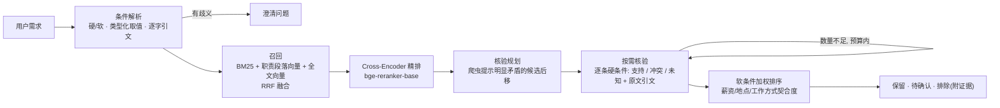

# Job Intelligence Agent

[English](README.en.md) | [简体中文](README.md)

       [](LICENSE)

一个岗位搜索 agent：输入一句自然语言求职需求，输出一份**带原文证据**的岗位名单。核心问题是——一个岗位到底满不满足用户的硬条件，应该由岗位原文里的证据来判断，而不是只看相似度分数，也不是一刀切的硬过滤。系统把需求拆成带类型的硬/软条件，先用检索和精排把候选缩小，再只在需要的时候让 LLM 逐条核验硬条件并引用原文；只有"核验过的冲突"才会把岗位排除，证据不足的岗位标为"待确认"，不会被当成已满足。语料是 2,613 条冻结的岗位快照（HackerNews "Who is Hiring" + Greenhouse/Lever 公开 API）。

## 项目背景

这个项目最早是 Johns Hopkins University 的 **Information Retrieval and Web Agents**（EN.601.466/666，David Yarowsky 教授授课，2026 春季）这门课的课程作业。课程版本包括爬虫、MySQL 存储、TF-IDF/BM25 检索、多字段打分引擎和质心分类器。课程结束后我在此基础上继续做了两层：一层是 vNext 流水线（Planner、Dense + RRF、LLM 精排、规则 Verifier、跨轮记忆），另一层是这份 README 主要讲的**证据核验 agent**（`src/agent/`）。旧流水线仍保留在仓库里（`src/pipeline/` 等，`streamlit run app.py` 是它的 demo），在评测里作为对照基线，`docs/system_design.md` 描述的也是旧流水线。

这个独立仓库是 2026-09-16 从课程仓库抽出来的，历史做了压缩，所以这里的 commit 记录不反映原始开发时间线。

## 工作原理


```mermaid
flowchart LR
    Q[用户需求] --> P["条件解析<br/>硬/软 · 类型化取值 · 逐字引文"]
    P -- 有歧义 --> CL[澄清问题]
    P --> R["召回<br/>BM25 + 职责段落向量 + 全文向量<br/>RRF 融合"]
    R --> RR["Cross-Encoder 精排<br/>bge-reranker-base"]
    RR --> PL["核验规划<br/>爬虫提示明显矛盾的候选后移"]
    PL --> V["按需核验<br/>逐条硬条件: 支持 / 冲突 / 未知 + 原文引文"]
    V -- 数量不足, 预算内 --> V
    V --> S["软条件加权排序<br/>薪资/地点/工作方式契合度"]
    S --> O["保留 · 待确认 · 排除(附证据)"]
```

1. **条件解析**（`conditions.py`）：需求被解析成一组条件，每条有字段（角色、技能、薪资、地区、工作方式、雇佣类型、资历、其他）、硬/软、有类型的取值，以及**必须是需求原文逐字片段**的引文；引文对不上会被拒绝并带反馈重试。跨字段的"或"（如"Austin 或全远程"）不会拆成两条独立硬条件，而是发起澄清。零条件的模糊请求（如"A good job"）同样返回澄清问题，不是报错。
2. **召回**（`retrieval.py`）：三个通道——BM25、只对"职责段落"做的向量检索（避免一个只在"要求"里罗列技能的岗位被当成真做这件事的岗位）、对全文开头做的向量检索，用 RRF 按名次融合；每个候选保留自己在各阶段的名次，用来解释排名变化。Embedding 不可用时降级为 BM25，并在 trace 里写明。
3. **精排**（`rerank.py`）：`bge-reranker-base` 交叉编码器。岗位文本事先按职责/要求/公司背景分段（`segmentation.py`），分段保存字符偏移，之后任何证据引文都能回到原文核对。
4. **按需核验**（`verification.py`、`evidence.py`）：核验器沿着排名往下走，让 LLM 对每个岗位的每条硬条件给出"支持 / 冲突 / 未知"，并且必须给出能在岗位原文里找到的引文；找不到引文的"支持/冲突"会被降级为"未知"，也不进缓存。只有核验过的冲突会排除岗位（连同证据展示）；"未知"的硬条件进入"待确认"，排在已确认的岗位之后。核验有预算（LLM 调用数、候选数、时限、重试），判断按（内容哈希、条件、模型、提示词版本）缓存。
5. **核验规划**（`planning.py`）：核验前先用爬虫抓到的薪资/地点/工作方式提示对硬条件做粗判，明显矛盾的候选排到后面，省下调用；这一步**永远不排除任何岗位**。
6. **排序与改条件**（`scoring.py`、`fit.py`、`explain.py`）：通过核验的岗位按软条件和权重排序，薪资、地点、工作方式的契合度复用旧引擎里的非对称薪资衰减和都会区邻近度。用户可以改硬软、改权重、删条件，系统复用已有判断重新排序，并解释名次为什么变化。
7. **服务与编排**：FastAPI 服务（`api.py`，状态有 `complete` / `partial` / `clarify` / `failed`，条件带版本号，并发相同请求共享一次计算），LangGraph 编排检索→精排→规划→核验并带有限重试（`graph.py`），`pages/agent_compare.py` 是把各阶段并排对比的 Streamlit 页面。

## 评估结果

评估框架在 `src/agent/evaluation.py`：岗位快照、条件、LLM 调用记录全部冻结，可以离线回放；总花费有上限，超过就拒绝再发请求。**下面所有数字都来自 `data/eval_results_agent_run2/` 里的文件，不是手写的。**

### 需求理解（人工审阅的金标）

| 集合 | 条件严格 P / R / F1 | 整条完全正确 | 应澄清时触发 | 不该问时多问 |
|---|---|---|---|---|
| dev（30 条，提示词是在它上面调的） | 0.805 / 0.835 / 0.820 | 11 / 30 | 2 / 5 | 0 / 25 |
| held-out（24 条，只跑了一次，没有据此再改提示词） | 0.767 / 0.805 / 0.786 | 6 / 24 | 2 / 5 | 1 / 19 |

提示词 v1 → v2 在 dev 上：F1 0.723 → 0.820，整条完全正确 3 → 11。held-out 上还有 2 条请求出现了不该有的硬条件（跨字段"或"被拆开）。held-out 里有 7 条请求超出当前 schema（地区排除、薪资区间上限、"mid 或 senior"等），这些条件标为不计分。

### 排序与核验（16 条查询，8 dev + 8 holdout，k = 5，均为每查询均值）

相关性标注是**模型标的银标**（标注提示词与被测系统不同），"valid" = 与职责相关且所有硬条件都被确认满足；"wrong accept" = 展示了银标判为无关、或有硬条件被判违反的岗位（未确认就放行的也算）。

| 系统 | dev valid@5 | dev wrong@5 | dev nDCG@5 | holdout valid@5 | holdout wrong@5 | holdout nDCG@5 | LLM 调用/查询 |
|---|---|---|---|---|---|---|---|
| 检索（原始请求） | 1.12 | 3.38 | 0.376 | 1.38 | 3.38 | 0.431 | 0 |
| 检索（角色/技能文本） | 0.62 | 3.88 | 0.224 | 1.25 | 3.75 | 0.292 | 0 |
| + Cross-Encoder 精排 | 0.75 | 3.62 | 0.220 | 1.50 | 3.38 | 0.504 | 0 |
| + 只核验前 k 个 | 0.50 | 0.25 | 0.243 | 1.38 | 0.50 | 0.503 | 4.6 / 5.0 |
| + 按需核验（回填） | 1.00 | 0.75 | 0.443 | 1.62 | 1.88 | 0.537 | 15.1 / 14.8 |
| + 全部核验 | 1.00 | 0.75 | 0.443 | 1.62 | 1.88 | 0.537 | 17.9 / 19.4 |

读法：

- **核验把"错放"压下来了**：相对只做精排，wrong@5 在 dev 上 3.62 → 0.75，在 holdout 上 3.38 → 1.88。
- **按需核验 vs 只核验前 k 个**：dev 上 valid@5 多 0.50（95% 区间 [+0.12, +0.88]），holdout 上多 0.25（区间 [0, +0.75]，不显著）；代价是多约 10 次调用，因为"只核验前 k 个"会把被排除的岗位直接丢掉而不回填。
- **按需核验 vs 全部核验**：16 条查询上 valid@5 完全相同，LLM 调用少约 20%。
- **精排和"角色/技能文本检索"没有稳定收益**：精排对检索顺序的提升在 dev（+0.12）和 holdout（+0.25）上区间都包含 0；用角色/技能文本检索并没有比直接用原始请求好。
- **核验规划**对 valid@5 没有影响，只少 0.1–0.4 次调用/查询。
- 判断提示词 v2 相比 v1：错排除 11 → 6，valid 和 nDCG 上升，但未确认放行变多（5 → 17）。未确认的放行都带"待确认"标记。

### 改条件后的复用（5 条新请求 × 4 种修改 = 20 次，真实链路）

| 修改 | 复用后 LLM 调用 | 整体重算调用 | 复用耗时 | 整体重算耗时 | 保留集合一致 |
|---|---|---|---|---|---|
| 改权重 | 3.0 | 18.8 | 3.98s | 15.96s | 4 / 5 |
| 软条件收紧为硬条件 | 3.2 | 18.8 | 4.55s | 15.16s | 4 / 5 |
| 硬条件放宽为软条件 | 1.8 | 10.0 | 3.42s | 9.42s | 5 / 5 |
| 删除条件 | 4.2 | 11.2 | 6.67s | 11.55s | 3 / 5 |

复用能明显减少调用，但保留集合并不总是和整体重算一致（20 次里 16 次一致），表里的不一致行保留在结果文件里，没有被过滤。

### 局限

- 银标由模型标注，没有人工端到端金标；查询只有 16 条，需求理解只有 30 + 24 条，标注是我起草、再经人工审阅。
- 排序/核验部分的修复是在看过这 16 条查询之后做的，所以那里的 dev 与 holdout 都不是干净的最终评估，只能当作开发指标和回归集。
- 核验只在冻结的快照上进行，没有向外部来源补查详情。
- 复用实验只有 5 条请求。

## 核心设计点

- **硬条件只在有原文冲突证据时才排除**，且排除的岗位连同证据一起展示，用户可以看到并推翻。
- **证据可回查**：引文必须在岗位规范化文本里能定位到，定位不到就降级为"未知"。
- **未知不当作满足**：证据不足的岗位标为"待确认"，排在已确认岗位之后。
- **评估可复现**：冻结快照、条件、LLM 记录；数字由脚本产出，不手填。
- 旧引擎里的薪资衰减和都会区邻近度被复用，而不是重写一套（`src/agent/fit.py`）。

## Demo

```bash
conda activate jobir
streamlit run app.py        # 侧边栏里的 agent_compare 页是新 agent 的阶段对比
```

## 快速开始

1. **Conda 环境**：`conda activate jobir`（Python 3.11；依赖见 `requirements.txt`）。首次使用精排会下载 `BAAI/bge-reranker-base`（约 1.1 GB）。
2. **环境变量**：`cp .env.example .env`，填入 `OPENAI_API_KEY`。
3. **岗位快照**：`data/agent/snapshots.db` 不入库。首次运行评测脚本时，如果它为空，会从 `data/structured_jobs.json` 导入。

```bash
# 离线回放评测（不发请求，不花钱）
python -m scripts.run_agent_eval run --mode replay

# 需求理解评测（会调用 LLM，约 $0.01）
python -m scripts.eval_requirements parse --gold data/agent_eval/requirements_heldout.json --out data/eval_results_agent_run2/requirements_heldout
python -m scripts.eval_requirements score --gold data/agent_eval/requirements_heldout.json --out data/eval_results_agent_run2/requirements_heldout

# 启动 API
uvicorn src.agent.api:create_default_app --factory

# 单元测试（离线）
pytest tests/
```

API：`POST /search`、`GET /tasks/{id}`、`POST /tasks/{id}/run`、`POST /tasks/{id}/revise`、`GET /jobs/{key}`、`GET /health`。

旧流水线（MySQL + TF-IDF/BM25/Dense + LLM 精排 + 规则 Verifier）的建库和运行方式见 `docs/环境配置.md`，命令行入口是 `python -m src.pipeline.graph "<query>"`。

## 项目结构

```
├── src/
│   ├── agent/            # 证据核验 agent：条件解析、分段、召回、精排、核验、规划、排序、评测、API
│   ├── spider/           # 爬虫 + 信息抽取
│   ├── db/               # 旧流水线的 MySQL 存储层与跨轮偏好记忆
│   ├── ir/               # TF-IDF / BM25 / Dense 检索 + RRF + 查询扩展
│   ├── scoring/          # 旧的多字段评分引擎、LLM 精排、规则 Verifier
│   ├── classification/   # 向量质心分类器
│   ├── llm/              # 旧流水线的查询理解与回答生成
│   ├── pipeline/         # 旧流水线的 LangGraph 编排
│   └── observability.py  # 每次调用的延迟/token/成本 trace
├── scripts/              # 评测与诊断脚本（run_agent_eval、eval_requirements、eval_incremental 等）
├── pages/                # Streamlit 页面（agent_compare）
├── data/
│   ├── agent_eval/                 # 查询集与需求标注（dev / held-out）
│   ├── eval_results_agent_run2/    # agent 评测产物（run2–run5、需求理解、改条件复用、冻结的 LLM 记录）
│   ├── eval_results/               # 课程报告用的历史 baseline
│   └── eval_results_vnext/         # 旧 vNext 流水线的评测数据
├── docs/                 # 旧流水线设计文档、环境配置
├── tests/                # 单元测试（离线）
└── .github/workflows/    # CI
```

## License

[MIT](LICENSE)
