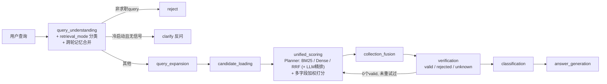

# Job Intelligence Agent

[English](README.md) | [简体中文](README.zh-CN.md)

      [](LICENSE)

基于自然语言查询的求职搜索系统，覆盖来自 HackerNews "Who is Hiring" 和 Greenhouse/Lever 公开 API 的 2,311 条职位。这类系统通常在两个极端之间选一个：要么对薪资/地点做硬过滤，把很接近的匹配也一并扔掉；要么把一切都丢给 LLM，从而失去对排序结果的控制。这个项目走的是第三条路——一个从零设计的多字段加权评分引擎（连续衰减打分，不做硬过滤），前面接一个按查询自适应检索策略的 Planner，LLM 的使用范围被刻意限制在查询理解、精排、生成回答这几处，而不是让它独自决定相关性。

## 项目背景

这个项目最早是 Johns Hopkins University 的 **Information Retrieval and Web Agents**（EN.601.466/666，David Yarowsky 教授授课，2026 春季）这门课的课程作业。课程版本包括爬虫、MySQL 存储、TF-IDF/BM25 检索、多字段打分引擎和质心分类器，作为课程项目评分。课程结束后我在此基础上加了 vNext 这一层：约束式 Planner、Dense 检索 + RRF 融合、LLM 精排、规则 Verifier 和跨轮偏好记忆。

这个独立仓库是 2026-09-16 从课程仓库抽出来的，历史做了压缩，所以这里的 commit 记录不反映原始开发时间线。

## 工作原理



检索方式不是部署时定死的，而是按每条 query 单独选择的。`query_understanding` 会把查询意图分类成 `exact`/`semantic`/`exploratory` 三档，一个受约束的 Planner 再把分类结果映射成具体的检索+精排组合：

| `retrieval_mode` | 含义 | 检索方式 | LLM 精排 |
|---|---|---|---|
| `exact` | 精确技术词、明确职位名 | BM25 | 关闭 |
| `semantic` | 意图清晰但用词不一定和职位原文重合 | BM25 + Dense 的 RRF 融合 | 关闭 |
| `exploratory` | 查询模糊、信息不足 | RRF 融合 | 开启 |

所以像"Python SRE 职位"这种精确查询，不会白白付出 dense 检索和精排的代价；而像"帮我找个工作"这种模糊查询才会用上这些。如果一条查询模糊到**完全没有任何可检索的信号**（既没有跨轮记忆兜底，也提取不出任何偏好字段），流水线会主动反问用户，而不是瞎猜着往下走。

打分排序完成之后，一个基于规则的 **Verifier** 会重新检查每条排名结果，判断相似度分数无法表达的约束——一个语义上很相关的职位，仍然可能是用户想要全职时的兼职/实习岗，或者用户指定了目标薪资但该职位完全没公开薪资范围。验证不通过的结果会被剔除；如果剔除后一个有效结果都不剩，流水线会用当前最强的检索组合重试一次，而不是无限重试。用户偏好也会在同一个聊天会话内持续生效（基于 MySQL，不是 LangGraph 自带的 checkpointer），所以"只要远程"这种话只用说一次，后续追问不用重复。

完整设计见 [docs/system_design.md](docs/system_design.md)——包含每个模块"原创 vs 基于库实现"的明确区分，以及一份诚实的声明：LLM 在哪些地方确实会影响排序、哪些地方不会。

## 评估结果

Pooled evaluation，40 条测试 query。**相关性标注由三个 LLM 评审（Claude、GPT、Gemini）多数投票产生，不是人工标注**——单人项目没有足够的人力标这么多 query，所以评测改成了 LLM-as-judge（`src/eval/e2e_metrics.py`，评审原始输出在 `data/eval_results_vnext/reviews_e2e/`）。看数字时请带上这个前提，尤其是被评测的精排器本身也是 LLM。

| Config | P@5 | nDCG@10 |
|---|---:|---:|
| BM25（vNext 之前最好的 baseline） | 0.375 | 0.567 |
| RRF 融合（BM25 + Dense）+ LLM 精排 | **0.620** | **0.743** |
| 差值 | **+24.5pp** | **+17.6pp** |

完整方法论和逐 query 结果见 `data/eval_results_vnext/`。

## 核心设计点

- **受约束的 Planner** —— 按 query 自适应选择检索策略，不是写死的固定流水线（`src/pipeline/graph.py`，`_PLANNER_MODE_MAP`）。
- **Dense 检索 + RRF 融合** —— OpenAI embeddings 能捕捉到和 query 没有共同词汇、但语义相关的职位；Reciprocal Rank Fusion 把它和 BM25 按名次融合，避免某一路的分数尺度主导另一路（`src/ir/dense.py`、`src/ir/rrf.py`）。
- **LLM 精排，且明确交代了范围** —— 精排是真实生效的，确实会影响排序；但它被 Planner 规则限制触发条件，只作用于粗排 Top 50，任何失败都会静默降级回粗排结果（`src/scoring/reranker.py`）。
- **Verifier + 有限重试** —— 纯规则判断，不产生额外 LLM 调用，专门抓相似度分数抓不住的问题（`src/scoring/verifier.py`）。
- **跨轮偏好记忆** —— 基于 MySQL 的会话级合并，没有用 LangGraph 自带的 interrupt/checkpointer 机制（`src/db/memory.py`）。
- **领域原创打分设计** —— 非对称衰减薪资打分、基于手工建表的美国都市圈分级地理邻近度、query 自适应权重归一化，这些都是在上面这层 LLM/检索之前就已经存在的原创设计（`src/scoring/engine.py`）。

## Demo


```bash
conda activate jobir
streamlit run app.py
```

检索策略由 Planner 自动选择；每个浏览器聊天会话都带一个 `session_id`，偏好会跨轮持续生效。

## 快速开始

1. **Conda 环境**：`conda activate jobir`（Python 3.11；依赖见 `requirements.txt`）。
2. **MySQL 8.0**：`mysql -u root -p < src/db/schema.sql` 建库建表，再 `python -m src.db.ingest_adapter` 导入 `data/structured_jobs.json`（约 2,311 条）。
3. **环境变量**：`cp .env.example .env`，填入 `OPENAI_API_KEY`（`DB_*` 如果和默认值不一样也一并改）。
4. **构建检索索引**（不入库，由 `data/structured_jobs.json` 派生）：`python -m src.ir.tfidf`、`python -m src.ir.bm25`、`python -m src.ir.dense`（最后一个会对约 2,311 条岗位调用一次 OpenAI embeddings API）。训练集扩展用的外部数据 `data/external/engineering_jobs.csv` 是公开的 HuggingFace 数据集 `yiqing111/Engineering_Jobs_Insight_Dataset`，需要重跑 `src.classification.expand_training_set` 时自行下载。

```bash
# 命令行，跑一次
python -m src.pipeline.graph "remote senior backend python in NYC around 150k"

# 交互式 demo
streamlit run app.py

# 单元测试（离线，不需要真实 DB/API）
pytest tests/
```

## 项目结构

```
├── docs/                # 系统设计、评估方法论、评估结果、报告草稿
├── src/
│   ├── spider/          # 爬虫 + 信息抽取
│   ├── db/               # MySQL 存储层 + 跨轮偏好记忆 (memory.py)
│   ├── ir/               # TF-IDF / BM25 / Dense 检索 + RRF 融合 + 查询扩展
│   ├── scoring/          # 多字段评分引擎 + Collection Fusion + LLM 精排 + Verifier
│   ├── classification/  # 向量质心分类器
│   ├── llm/              # LLM 查询理解（含检索模式分类）+ 回答生成
│   └── pipeline/         # LangGraph 流水线编排（Planner、验证重试、反问/拒绝）
├── data/                 # 静态资源 + 评估产物（data/eval_results/ 是已交付课程报告用的历史 baseline；data/eval_results_vnext/ 是 vNext 之后的实测数据——刻意分开存放）
├── tests/                # 单元测试（离线——外部调用全部 mock）
└── .github/workflows/    # CI
```

## License

[MIT](LICENSE)
